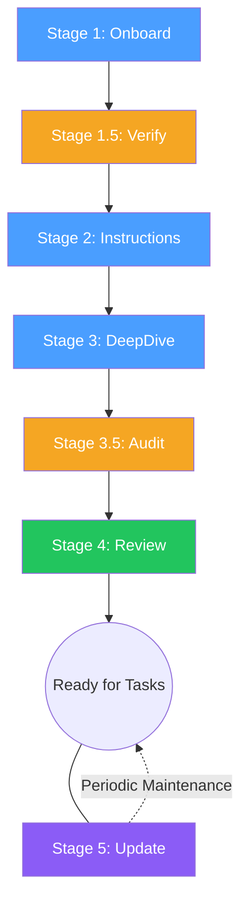

# Agentic Context Framework (ACF)

[](LICENSE)

AI agents don't understand your architecture, your conventions, or why you made the decisions you made. Without this context, they generate code that works but doesn't fit.

**The missing layer isn't better models. It's better context.**

ACF is a structured approach to providing AI agents with the architectural knowledge, guardrails, and decision history they need to generate code that fits your system — not just code that works. It treats agent context as a first-class engineering artefact: versioned in the repo, maintained alongside the code, and reviewed in every PR.

---

## The Three Pillars

| Pillar | What it is | Where it lives |
| :--- | :--- | :--- |
| **Agent Instructions** | Generated, repo-specific architectural boundaries, conventions, and risk triggers | `AGENTS.md` |
| **Architecture Docs** | High-level system maps, service boundaries, and deep-dive documentation | `docs/` |
| **Agent Decision Context (ADC)** | Decision records and execution plans that capture the "why" behind the code | `docs/adc/` |

---

## Quick Start

Clone or download this repo first — the steps below assume you have a local copy to copy files from.

**1. Copy the folder** for your AI tool into your repo root:

| Tool | Copy this folder |
| :--- | :--- |
| Claude Code | `.claude/agents/` |
| Gemini CLI | `.gemini/agents/` |
| GitHub Copilot | `.github/agents/` |
| Codex | `.codex/agents/` |
| Cursor | `.cursor/agents/` |

**2. Run the pipeline** — pick one:

**Automated (recommended):** Copy the runner script for your tool from `scripts/` to your repo root and run it:

```bash
./acf-run-claude.sh
```

| Tool | Script |
| :--- | :--- |
| Claude Code | `scripts/acf-run-claude.sh` |
| Codex | `scripts/acf-run-codex.sh` |
| GitHub Copilot | `scripts/acf-run-copilot.sh` |
| Gemini CLI | `scripts/acf-run-gemini.sh` |

The script runs all 6 stages in sequence with model switching between generation and verification stages, each in a fresh session.

**Manual:** Run Stage 1, then follow the stages (1 → 1.5 → 2 → 3 → 3.5 → 4). Each verification stage should run in a fresh session.

> `Run Stage 1: Onboard`

**3. After Stage 4**, copy `docs/adc/` from this repo into your project's `docs/` folder for the ADC templates.

**4. Schedule Stage 5** after significant releases to keep docs current.

> **ACF is a collaboration.** Agents generate the baseline from code. Humans bring the context that code can't express — business constraints, tribal knowledge, and the reasoning behind legacy decisions. Review and enrich the docs at each stage before moving on.

See [SETUP.md](SETUP.md) for detailed per-tool setup instructions.

---

## The `acf-context-agent` Workflow

The `acf-context-agent` is the engine behind ACF. It generates, verifies, and maintains your documentation through a structured pipeline of stages. Each stage runs as a single prompt — you invoke the agent, tell it which stage to run, and it does the rest.

AI agents generate useful documentation, but they make predictable errors — wrong counts, fabricated identifiers, behavioral assumptions from training data. Even the best models routinely fail to follow complex instructions perfectly.

ACF doesn't try to make the generator perfect. It catches what the generator gets wrong through dedicated verification stages that run in fresh sessions — where the model can't confirm its own mistakes.



### Generation stages

| Stage | What it does | Output |
| :--- | :--- | :--- |
| **1. Onboard** | Scans the repo — project layout, entrypoints, technologies, cross-cutting concerns, testing approach | `docs/ARCHITECTURE-OVERVIEW.md` (10 required sections) |
| **2. Instructions** | Generates repo-specific conventions, build commands, architecture rules, and a **Retrieval Discipline** — a numbered procedure that tells agents exactly how to load context for this repo | `AGENTS.md` + platform pointer file |
| **3. DeepDive** | Creates detailed docs for every complex area (Auth, Database, Messaging, etc.) with verbatim code quotes for critical methods | `docs/*.md` (one per topic) |

### Verification stages

| Stage | What it does | Why a fresh session |
| :--- | :--- | :--- |
| **1.5. Verify** | Verifies every claim in `ARCHITECTURE-OVERVIEW.md` against source — names, counts, behaviors, type classifications | Models can't separate what they "know" from what they just wrote. A fresh verifier catches errors a same-session one confirms. |
| **3.5. Audit** | Verifies all documents against source. Cross-references across docs for consistency. Catches errors from Stages 2-3. | Same reason — prevents confirmation bias from the generation stages. |
| **4. Review** | Independent review — ideally a different model. Audits behavioral claims, cross-document consistency, and link integrity. Consistently catches errors that survived earlier stages. | Maximum independence. A different provider gives the strongest guarantee. A fresh session with the same model is sufficient for most teams. |

### Maintenance

| Stage | What it does |
| :--- | :--- |
| **5. Update** | Periodic maintenance. Re-reads source, detects architectural drift, updates all docs. Incorporates ADC decisions into deep-dives. Schedule after significant releases. |

### How it runs

- **State tracking:** The agent tracks progress in `docs/.acf-state.md` — a checklist of completed stages with dates and model IDs. If a session is interrupted, the agent resumes from the last checkpoint.
- **Fresh sessions required:** Verification stages (1.5, 3.5, 4) must each run in a new session to prevent confirmation bias. Generation stages (1, 2, 3) can run back-to-back.
- **No delegation:** Document content is always generated in the main conversation thread, not by subagents. This ensures the highest-capability model writes every claim.
- **Self-correcting:** Each verification stage corrects errors immediately and logs them in a corrections table appended to `docs/.acf-state.md`.

> **Why three layers of verification?** Generation alone produces documentation that is often *plausible* but not always *accurate*. Stages 1.5 and 3.5 catch most factual errors. Stage 4 catches what survives. Each layer compounds the reliability of the final output.

---

## Agent Decision Context (ADC)

Architecture docs explain *what* the system is. ADCs explain *why* — what changed, why, what was rejected, what it affects, and how to deploy and roll back safely.

- **ADC Record** (`docs/adc/`) — the decision and its context
- **Execution Plan** (`docs/adc/plans/`) — optional step-by-step implementation

See the included example: [`adc-example/docs/adc/2026-02-27--external-user-entity.md`](adc-example/docs/adc/2026-02-27--external-user-entity.md)

---

## Why This Matters

**For AI Coding Tools** — Without context, agents scan 30+ files to infer what a single architecture doc could tell them. With ACF, agents read docs first, then make targeted source reads — cutting token usage and improving accuracy. [See it in action.](ACF-VS-NO-ACF-COMPARISON.md)

**For Agentic DevOps** — As agents move from suggestions to autonomous execution, an agent without architectural context isn't just unhelpful — it's dangerous. ACF is the safety layer.

**For Legacy Modernisation** — ADCs capture the decisions embedded in legacy code before they're lost in translation.

> Not for every team — see [WHEN-ACF-WORKS.md](WHEN-ACF-WORKS.md) for where it fits and where it doesn't.

---

## Maturity Model

| Level | State | Characteristics |
| :--- | :--- | :--- |
| **0** | Ad Hoc | No agent context. Generic, often incorrect code. High rework. |
| **1** | Onboarded | Stages 1-4 complete. Structurally correct code. Common mistakes reduced. |
| **2** | Practicing | Stage 5 runs periodically. ADCs created for significant changes. |
| **3** | Trusted | Full ADC discipline. Autonomous agentic workflows become viable. |

---

## Further Reading

| Document | What it covers |
| :--- | :--- |
| [SETUP.md](SETUP.md) | Per-tool installation and invocation instructions |
| [FAQ.md](FAQ.md) | Common questions about setup, stages, ADCs, and team adoption |
| [WHEN-ACF-WORKS.md](WHEN-ACF-WORKS.md) | Where ACF delivers and where it doesn't |
| [LIMITATIONS.md](LIMITATIONS.md) | Honest account of gaps and error classes |
| [ACF-VS-NO-ACF-COMPARISON.md](ACF-VS-NO-ACF-COMPARISON.md) | Side-by-side comparison with and without ACF |

---

## Contributing

Issues and discussion welcome. For changes beyond typos, open an issue first — ACF is intentionally lean and opinionated, and the bar for changes is real-world usage on a real codebase.

---

## License

MIT License. See [LICENSE](LICENSE) for details.
